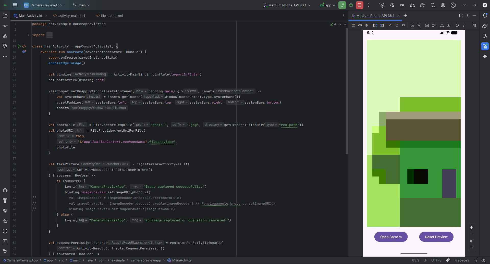

# Camera Preview App

A simple Android app to capture photos using the device camera and display a preview.



## Features

- Requests camera permission from the user
- Captures photos using the device's native camera
- Displays preview of the captured photo
- Allows resetting the preview to the default image

## Technologies

- Kotlin
- ViewBinding
- Activity Result API
- FileProvider for secure file sharing

## Required Permissions
```xml
<uses-permission android:name="android.permission.CAMERA" />
```

## How to Use

1. When opening the app, grant camera permission when prompted
2. Tap the "Open Camera" button to capture a photo
3. The captured photo will be displayed in the preview
4. Use the "Reset Preview" button to clear the view